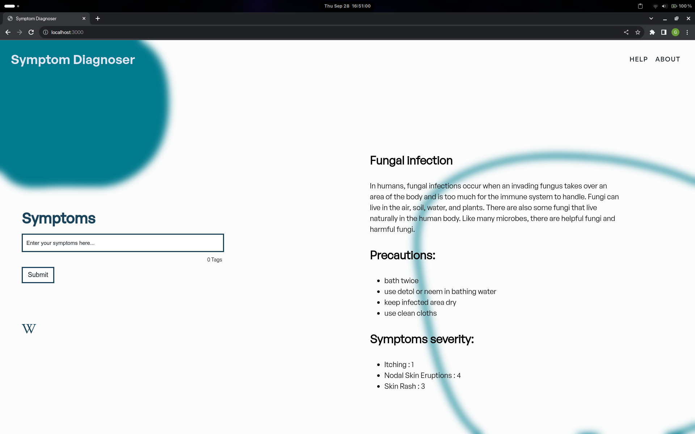
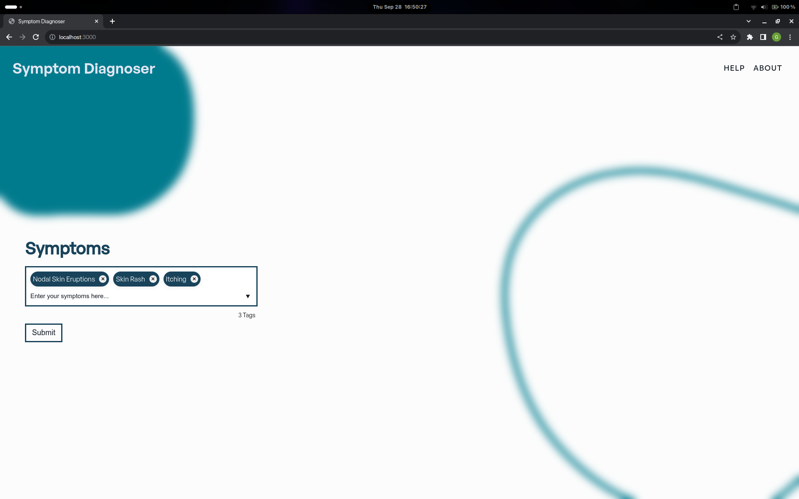

# Symptom Diagnoser

---

In this project I'm creating a simple machine learning model which gets disease symptoms as input and predicts the what disease it is.

I am using ensemble model in this project, it makes use of Navie Bayes, Random Forest Classifier and Support Vector Classifier to predict the diseases.

---

## Technologies used

### Frontend

- **EJS** (Embedded JavaScript)
- **CSS** (Cascading StyleSheets)
- **JavaScript**

### Backend

- **Express.js** - for managing requests from the user.
- **Flask** - for getting making the trained and tested model available to the Express.js server.
- **Scikit-learn** - used for creating and training ML models.

---

## Images

### Credits

- [Dataset for training was from kaggle uploaded by PRANAY PATIL](https://www.kaggle.com/datasets/itachi9604/disease-symptom-description-dataset)

- [Dataset for training the main model was from kaggle uploaded by KAUSHIL268](https://www.kaggle.com/datasets/kaushil268/disease-prediction-using-machine-learning?rvi=1)
